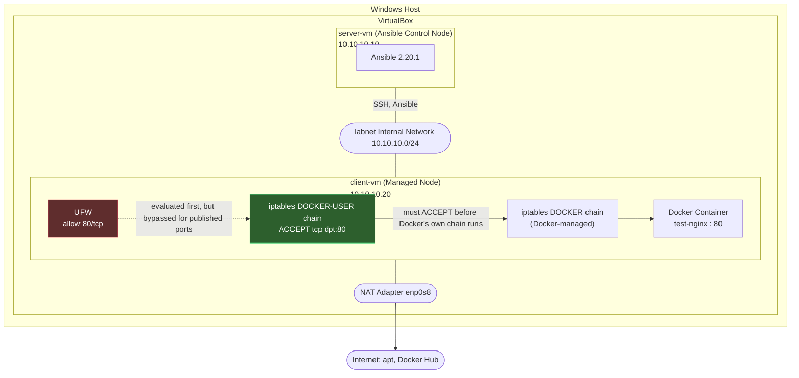

# Ansible Lab — Project 7

Automated baseline configuration of `client-vm` using Ansible, run from a
control node (`server-vm`) over SSH.

## Network Topology

This project builds on the shared lab network topology established in
[linux-networking-lab](https://github.com/Landry5545/linux-networking-lab#network-topology).
`server-vm` and `client-vm` communicate over the internal `labnet`
network, with NAT adapters providing internet access independently on
each VM.

## Architecture

- **Control node:** `server-vm` (10.10.10.10) — Ansible 2.20.1
- **Managed node:** `client-vm` (10.10.10.20) — Ubuntu Server, targeted via
  `inventory.ini`
- **Network:** VirtualBox internal network `labnet` (10.10.10.0/24) for
  control-to-managed communication, plus a NAT adapter on `client-vm` for
  internet access (required for `apt` package installs)

## Files

| File            | Purpose                                              |
|-----------------|-------------------------------------------------------|
| `ansible.cfg`   | Disables deprecation warnings and host key checking  |
| `inventory.ini` | Defines `client-vm` under the `[managed]` group      |
| `setup.yml`     | Baseline setup playbook (see below)                  |

## Playbook: `setup.yml`

```yaml
---
- name: Basic server setup
  hosts: managed
  become: yes

  tasks:
    - name: Install useful tools
      apt:
        name:
          - curl
          - net-tools
        state: present
        update_cache: yes

    - name: Ensure UFW is installed
      apt:
        name: ufw
        state: present

    - name: Allow SSH through UFW
      ufw:
        rule: allow
        name: OpenSSH

    - name: Enable UFW
      ufw:
        state: enabled

    - name: Print success message
      debug:
        msg: "Server setup complete on {{ inventory_hostname }}"
```

## Running It

```bash
cd ~/ansible-lab
ansible-playbook -i inventory.ini setup.yml
```

## Architecture — Project 8


## Troubleshooting Log

Three real issues came up bringing this playbook from draft to a clean run:

**1. YAML typo — `becomes` instead of `become`**
Ansible rejected the play with `[ERROR]: 'becomes' is not a valid attribute
for a Play`. Fixed by correcting the keyword to `become: yes`.

**2. Sudo required an interactive password**
Once the YAML was valid, tasks failed with:
sudo: interactive authentication is required
Ansible has no way to type a sudo password interactively mid-playbook. Fixed
by granting passwordless sudo to the managed-node user via `visudo`:
landry5545 ALL=(ALL) NOPASSWD: ALL

**3. `client-vm` had no internet route**
With sudo fixed, `apt` cache updates timed out repeatedly:
Failed to update apt cache after 5 retries
`client-vm` only had the internal `labnet` adapter (`enp0s3`), so it could
reach `server-vm` but not the internet. Fixed by:
- Adding a second NAT adapter in VirtualBox (`enp0s8`)
- Discovering `/etc/netplan/50-cloud-init.yaml` had incorrectly applied the
  same static `10.10.10.20/24` address to `enp0s8` as `enp0s3`
- Correcting that file so `enp0s8` uses `dhcp4: true`, letting it pull a
  proper NAT address (`10.0.3.x`) and reach the internet

After these fixes, `ansible-playbook -i inventory.ini setup.yml` completed
with `ok=6, changed=2, failed=0`.

## Playbook: `docker-setup.yml` (Project 8)

Installs Docker Engine + Compose, deploys an nginx test container, and
closes a real security gap where Docker silently bypasses UFW rules.

### What it does
- Installs Docker CE, CLI, containerd, and the Compose plugin
- Enables and starts the Docker service
- Adds the managed-node user to the `docker` group
- Deploys an `nginx:latest` container published on port 80
- Locks down port 80 properly via the `DOCKER-USER` iptables chain
  (see Troubleshooting below for why this matters)
- Installs `iptables-persistent` so the rule survives reboots

### Running it
```bash
cd ~/ansible-lab
ansible-playbook -i inventory.ini docker-setup.yml
```

## Troubleshooting Log — Project 8

**1. DNS failure on `client-vm`'s NAT adapter**
`apt` timed out repeatedly with `Failed to update apt cache after 5
retries`. Root cause: the NAT adapter's DHCP-provided DNS server
(`192.168.1.1`, the host's LAN router) isn't reachable from inside the
VM's isolated NAT network. Fixed by hardcoding public DNS servers
(`8.8.8.8`, `1.1.1.1`) in `/etc/netplan/50-cloud-init.yaml` for `enp0s8`.

**2. Docker repo unavailable for a brand-new Ubuntu release**
Once DNS worked, `apt-cache policy docker-ce` showed no candidate.
`lsb_release -cs` returned `resolute` (Ubuntu 26.04), and Docker's
official repo hadn't published packages for that codename yet. Fixed by
hardcoding the repo to `noble` (24.04) instead of templating on
`{{ ansible_distribution_release }}` — Docker's `.deb` packages are
compatible across adjacent LTS/interim releases.

**3. Architecture mismatch in the repo line**
Even after fixing the codename, `docker-ce` still showed no candidate.
Root cause: `{{ ansible_architecture }}` resolves to `x86_64` on Ubuntu,
but Docker's repo structure expects `amd64`. Fixed by hardcoding
`arch=amd64` in the repo definition instead of templating it.

**4. YAML indentation error**
A block of new tasks was indented at a different level than the rest of
the `tasks:` list, causing `While parsing a block mapping did not find
expected key`. Fixed by aligning all task-level `- name:` entries to the
same indentation.

**5. Docker silently bypasses UFW**
After deployment, `ufw status` showed port 80 allowed — but setting it to
**deny** had no effect; `curl localhost:80` still succeeded. Root cause:
Docker manages its own iptables rules in the `DOCKER` chain, which are
evaluated *before* UFW's chain, so UFW's allow/deny state is cosmetic for
published container ports. Verified by:
```bash
sudo ufw deny 80/tcp
curl localhost:80   # still succeeded — confirms the bypass
```
Fixed properly by inserting an explicit rule into the `DOCKER-USER` chain
(which Docker guarantees is evaluated first) and persisting it with
`iptables-persistent`:
```bash
sudo iptables -I DOCKER-USER -p tcp --dport 80 -j ACCEPT
sudo netfilter-persistent save
```
This is now automated in `docker-setup.yml` rather than a manual step.

## Next Steps

- Expand inventory as more managed nodes are added
- Consider a reverse-proxy playbook building on the Docker setup
